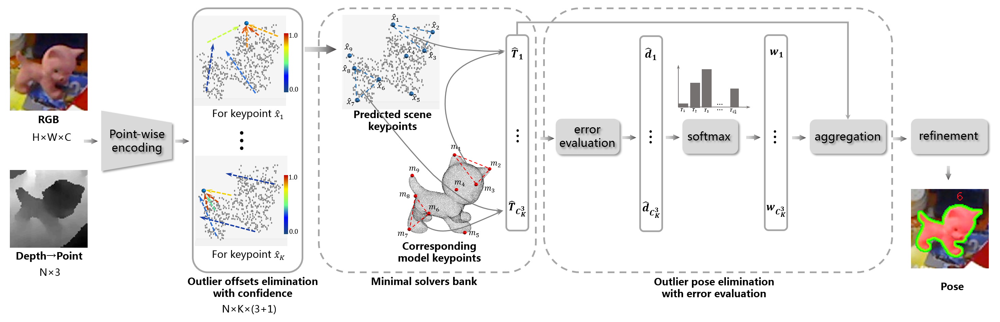

# REDE

## Overview

This is an implementation of the paper "REDE: End-to-end Object 6D Pose Robust Estimation Using Differentiable Outliers Elimination". [[paper]](https://arxiv.org/abs/2010.12807) [[video]](https://www.youtube.com/watch?v=vU8_nhTmYbM)



## Dependencies

- Python 3.8
- PyTorch 1.4
- CUDA 10.0

## Installation

1. Set up python environment

```shell
pip install -r requirement.txt
```

2. Compile KNN

```shell
cd lib/KNN_CUDA
$ROOT=/path/to/REDE
export PATH=$ROOT/lib/KNN_CUDA:$PATH
make && make install
```

3. Compile SVD

```shell
cd lib/torch-batch-svd
python setup.py install
```

4. Compile FPS

```shell
cd lib/fps
python setup.py install
```

## Datasets

### Prepare the dataset

Download the [preprocessed LineMOD dataset](https://drive.google.com/drive/folders/19ivHpaKm9dOrr12fzC8IDFczWRPFxho7) and [supplement](https://drive.google.com/file/d/1jnFKyolLUvbE1BhpGxUZRWSaWUP3oMmh/view?usp=sharing) (including fuse data, keypoints and script for pose format conversion), put supplement into `Linemod_preprocessed` and run `gt_to_npy.py`.

Download the [preprocessed Occlusion LineMOD dataset](https://drive.google.com/file/d/11hxQ57jXw-ELSY74AAHDVcx2Eahm4aEq/view?usp=sharing).

Download the [YCB_Video Dataset](https://rse-lab.cs.washington.edu/projects/posecnn/).

### Create the soft link

```shell
ln -s path/to/LineMOD datasets/linemod/data
ln -s path/to/Occlusion_LineMOD datasets/occlusion_linemod/data
ln -s path/to/YCB datasets/ycb/data
```

### Compute FPS keypoints

```shell
python lib/fps/get_fps.py
```

## Training

- LineMOD:

```shell
python tools/train_linemod.py --obj_id 1
```

- YCB:

```shell
python tools/train_ycb.py
```

## Evaluation

You can download the trained checkpoints from Link ([LineMOD](https://drive.google.com/file/d/13TECYXTB_ZRKNNG-WJAtbKZi_hHbGrcw/view?usp=sharing), [YCB](https://drive.google.com/file/d/1hEk579cntYxmngbnXVR9eb_4VxUtyGst/view?usp=sharing)) and put them to `checkpoints`. 

- LineMOD:

```shell
python tools/eval_linemod.py
```

- Occlusion LineMOD:

```shell
python tools/eval_occ.py
```

- YCB:

```shell
python tools/eval_ycb.py
```
